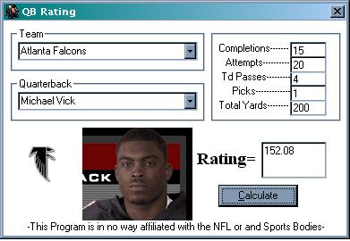



## Nfl QB Rating Calculator

### Description

-Well,with the NFL season upcoming I needed something to take up some time so I wrote this program to calculate the qb rating of your favorite player. The program will load the image of the Qb you choose and his team emblem(see the screenshot) and calculate his rating based on values you enter. I have includedthe calculation from the Nfl website in hopes that someone can find the error i made in the math code.The rating for the values entered should be 125.00 even. The math is wrong so.please dont vote.Hopefully someone who likes football as much as i do and codes better than me can figure this out.e- mail for questions or comments: de_killer_bee@hotmail.com
 
### More Info
 

             |
---                |---
**Submitted On**   |2001-08-20 11:59:46
**By**             |[Doc QZ](https://github.com/Planet-Source-Code/PSCIndex/blob/master/ByAuthor/doc-qz.md)
**Level**          |Beginner
**User Rating**    |5.0 (15 globes from 3 users)
**Compatibility**  |VB 6\.0
**Category**       |[Miscellaneous](https://github.com/Planet-Source-Code/PSCIndex/blob/master/ByCategory/miscellaneous__1-1.md)
**World**          |[Visual Basic](https://github.com/Planet-Source-Code/PSCIndex/blob/master/ByWorld/visual-basic.md)
**Archive File**   |[Nfl QB Rat254048272001\.zip](https://github.com/Planet-Source-Code/doc-qz-nfl-qb-rating-calculator__1-26686/archive/master.zip)

